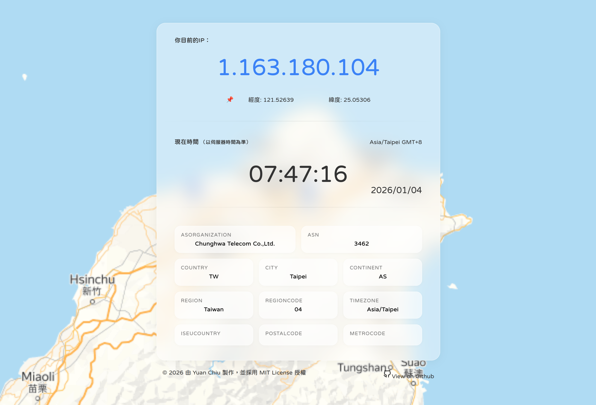

Cloudflare MyIP 查詢我現在的公網IP
===


先前在製作適用於Cloudflare的 [HTTP Echo Server](https://github.com/chyuaner/cloudflare-echo-server) 專案時，有用到 [Cloudflare Geolocation: Hello World](https://developers.cloudflare.com/workers/examples/geolocation-hello-world/) 的範例，可以取得你現在的公網IP地址。在此基礎下，我將原有在HTTP Echo Server專案中的MyIP功能抽出，然後以Hono框架重新再寫一套獨立專門的查詢站。

除了提供精美的網頁面以外，也提供純文字回應，可搭配 curl 或自行開發的客戶端使用。也提供精美的圖片生成可直接下載png圖檔。

也有整合meta social og可以在轉貼時以摘文形式直接觀察該平台的狀況（不過本專案僅提供IP查詢，若要觀察該平台的完整環境狀況，請使用[HTTP Echo Server](https://github.com/chyuaner/cloudflare-echo-server)）。

另外提供的「現在時間」是以Cloudflare伺服器的時間為準，方便給你當作對時工具使用。

## 用法與預覽
### 可用在終端機用以下方式直接取得
```sh
curl -s https://myip.yuaner.tw | jq
curl -s "https://myip.yuaner.tw/ip.png" | magick - SIXEL:-
curl https://myip.yuaner.tw/country
curl https://myip.yuaner.tw/now
curl https://myip.yuaner.tw/utc
```

### 也可以針對特定需求單獨瀏覽
* 本站網址：<https://myip.yuaner.tw>
* 查詢IP與資訊：<https://myip.yuaner.tw/ip>
* 查詢IP與資訊(png)：<https://myip.yuaner.tw/ip.png>
* 本站網址：<https://myip.yuaner.tw/now>
* 本站網址：<https://myip.yuaner.tw/utc>

### 也可以直接抓取圖片：

圖片下載點： <https://myip.yuaner.tw/ip.png>

PS. 本預覽圖因為有進Github CDN快取，所以在本頁面上看到的資訊很可能是Github CDN環境的IP地址，不是你真正的公網IP。請以實際用 <https://myip.yuaner.tw/ip.png> 直連取得到的為主。

## 本專案特色
-   **雙棧支援**：完整支援 IPv4 與 IPv6 檢測。
-   **提供地理資訊**：提供包括 ISP、ASN、國家、城市、大洲、時區等詳細數據。
-   **動態地圖背景**：根據使用者目前位置即時呈現地圖背景（採用 Yandex Maps）。
-   **進階設計感**：現代化的毛玻璃（Glassmorphism）UI，具備平滑動畫並完整支援深色模式（Dark Mode）。
-   **多格式介面**：
    -   **HTML**：專為人類設計的美觀網頁介面。
    -   **JSON**：專為開發者提供的結構化數據。
    -   **純文字**：適合 `curl` 等 CLI 工具使用的簡潔輸出。
    -   **png圖片輸出**：已整合`@cf-wasm/og`可直接由後端產出png圖片
-   **時間服務**：提供以Cloudflare為主的本地時區與UTC時區。

### 技術特色
-   **Cloudflare 原生**：針對 Cloudflare Workers 優化，確保高效能與安全性。
-   **100%由後端渲染**：本站沒有使用React等複雜的CSR技術，完全由後端直接輸出純淨的 HTML 結構，確保客戶端擁有最大的相容性與效能，甚至在完全關閉 JavaScript 的極端環境下，依然能提供最核心、完整的基礎功能。
-   **字體壓縮**：本站採用[justfont open 粉圓](https://justfont.com/huninn/)字體，但有做子集化壓縮處理，在保證使用者能看到我指定的字體樣式以外，也不要讓使用者產生多餘無用的下載流量負擔，來保證效能。（字體設計也同樣適用於OG圖片產生）
-   **OG圖片產生**：本專案採用Cloudflare可直接由`vercel/og`動態生成圖片，而且有做效能考量，預先把已經畫好的背景與外框存成圖片，og僅處理壓上文字，不做外框漸層的渲染，來保證效能。

## 部署方式

本專案支援Cloudflare Workers、Vercel、傳統 Node.js三種方式部署：

### Cloudflare Workers (主推)
官方推薦的部署方式，充分利用 Cloudflare 的全球邊緣網路與原生地理位置數據。
-   **指令**：`npm run deploy`

### Vercel
支援部署為 Vercel Functions。
-   **指令**：可透過 `npm run dev:vercel` 進行本地開發測試，或直接經由 Vercel Dashboard/CLI 部署。

### 傳統 Node.js 伺服器
作為標準 Node.js 應用程式運行（使用 `@hono/node-server`）。適合 Docker 或私有伺服器。
-   **指令**：`npm start` 或 `npm run start:node`。
-   **備註**：內建 GeoIP 資料庫解決方案（透過 `mmdb-lib`），解決非 CF 環境下的 IP 查詢需求。

## 開發此專案的建置說明

### 1. git clone 此專案
### 2. 安裝相關套件
```bash
npm install
```

### 3. 本地開發 (Wrangler)
```bash
npm run dev
```

#### 型別生成

[根據您的 Worker 配置產生/同步型別控制](https://developers.cloudflare.com/workers/wrangler/commands/#types):

```bash
npm run cf-typegen
```

---

### 本專案採用MIT授權
This project is licensed under the [MIT License](LICENSE).
